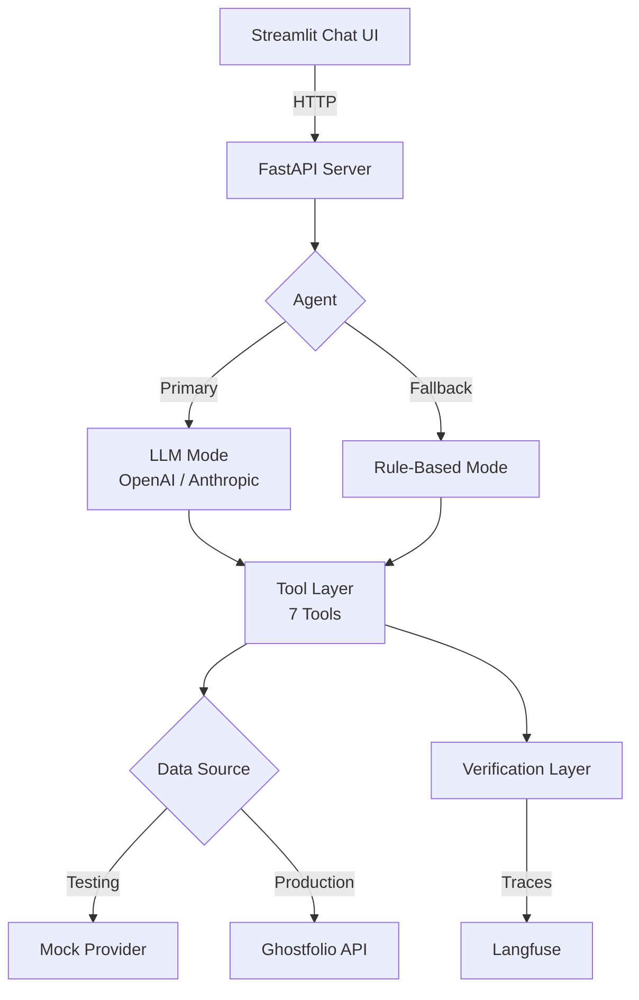

# Ghostfolio AI Agent

AI-powered conversational portfolio assistant for [Ghostfolio](https://ghostfol.io). Ask natural-language questions about your portfolio and get verified, fact-grounded responses.

## Architecture



**Dual-mode agent**: LLM-powered tool calling with automatic rule-based fallback. Every response passes through fact-grounding, disclaimer enforcement, and confidence scoring.

## Features

- **7 portfolio tools**: Summary, performance, transactions, accounts, market data, allocation analysis, risk rules
- **LLM integration**: OpenAI GPT-4.1 (primary) with Anthropic Claude fallback
- **Verification layer**: Fact grounding, financial disclaimer, trade advice refusal, prompt injection defense
- **Observability**: Langfuse tracing for tool calls, LLM invocations, and verification
- **50+ eval test cases**: Deterministic checks + LLM-as-judge scoring
- **Production-ready**: FastAPI + Streamlit, Railway deployment, CI/CD with linting and evals

## Quick Start

```bash
# 1. Setup
python -m venv .venv
source .venv/bin/activate
pip install -e ".[dev]"

# 2. Configure (optional — works with mock data by default)
cp .env.example .env  # Add API keys if desired

# 3. Run API
uvicorn app.main:app --reload

# 4. Run Chat UI (new terminal)
streamlit run ui/streamlit_app.py

# 5. Test
pytest -v

# 6. Run evals
python evals/run_evals.py
```

## Configuration

Environment variables (prefix: `GHOSTFOLIO_`):

### Core
| Variable | Default | Description |
|----------|---------|-------------|
| `GHOSTFOLIO_DEFAULT_DATA_SOURCE` | `mock` | `mock` or `ghostfolio_api` |
| `GHOSTFOLIO_BASE_URL` | `https://ghostfol.io` | Ghostfolio instance URL |
| `GHOSTFOLIO_REQUEST_TIMEOUT_SECONDS` | `10` | HTTP timeout |

### LLM
| Variable | Default | Description |
|----------|---------|-------------|
| `GHOSTFOLIO_OPENAI_API_KEY` | — | OpenAI API key |
| `GHOSTFOLIO_OPENAI_MODEL` | `gpt-4.1` | OpenAI model |
| `GHOSTFOLIO_ANTHROPIC_API_KEY` | — | Anthropic API key (fallback) |
| `GHOSTFOLIO_ANTHROPIC_MODEL` | `claude-sonnet-4-20250514` | Anthropic model |
| `GHOSTFOLIO_LLM_ENABLED` | `true` | Enable/disable LLM mode |

### Observability
| Variable | Default | Description |
|----------|---------|-------------|
| `GHOSTFOLIO_LANGFUSE_PUBLIC_KEY` | — | Langfuse public key |
| `GHOSTFOLIO_LANGFUSE_SECRET_KEY` | — | Langfuse secret key |
| `GHOSTFOLIO_LANGFUSE_HOST` | `https://cloud.langfuse.com` | Langfuse host |

### Logging
| Variable | Default | Description |
|----------|---------|-------------|
| `GHOSTFOLIO_LOG_LEVEL` | `INFO` | `DEBUG\|INFO\|WARNING\|ERROR` |
| `GHOSTFOLIO_LOG_FORMAT` | `json` | `json` or `text` |

## Tools

| Tool | Description |
|------|-------------|
| `get_portfolio_summary` | Portfolio value, holdings, allocations |
| `get_performance` | Returns for time ranges (1d, ytd, 1y, 5y, max) |
| `get_transactions` | Buy/sell activity history |
| `get_account_details` | Linked brokerage accounts and balances |
| `get_market_data` | Current prices for stock/ETF symbols |
| `analyze_allocation` | Sector, region, asset class breakdown + risk flags |
| `check_risk_rules` | Concentration, diversification, asset class risk checks |

## Verification

Every response is verified before delivery:
- **Fact grounding**: Numerical claims traced to tool output
- **Disclaimer**: Financial disclaimer on every response
- **Trade advice refusal**: Buy/sell recommendations politely refused
- **Prompt injection defense**: Override attempts detected and blocked
- **Data freshness**: Stale data warnings (>6h old)
- **Confidence scoring**: 0.4 (low) — 0.95 (high)

## Evaluation

```bash
# Deterministic evals (50+ test cases, >80% gate)
python evals/run_evals.py

# LLM-as-judge (requires OpenAI key, advisory)
python evals/llm_judge.py
```

Categories: happy path (21), edge cases (10), adversarial (12), multi-step (10)

## Deployment (Railway)

1. Create a Railway project from this repo
2. Set environment variables:
   - `GHOSTFOLIO_DEFAULT_DATA_SOURCE=mock` (or `ghostfolio_api`)
   - `GHOSTFOLIO_OPENAI_API_KEY=sk-...` (optional, for LLM mode)
   - `GHOSTFOLIO_LANGFUSE_PUBLIC_KEY` / `GHOSTFOLIO_LANGFUSE_SECRET_KEY` (optional)
3. Deploy — Railway uses `Procfile`: `web: bash scripts/start.sh`
4. The Streamlit UI is the public entrypoint on `$PORT`

## Project Structure

```
ghostfolio-agent/
├── app/
│   ├── agent.py           # Dual-mode LLM + rule-based agent
│   ├── config.py          # Environment-based settings
│   ├── ghostfolio_client.py # HTTP client with retry
│   ├── llm.py             # LLM factory (OpenAI/Anthropic)
│   ├── main.py            # FastAPI server
│   ├── observability.py   # Langfuse tracing
│   ├── schemas.py         # Pydantic models
│   ├── telemetry.py       # Structured logging
│   ├── tool_defs.py       # Tool schemas for LLM
│   ├── tools.py           # 7 tool implementations
│   └── data_sources/
│       ├── base.py        # Provider protocol
│       ├── mock_provider.py
│       └── ghostfolio_api_provider.py
├── evals/
│   ├── eval_dataset.json  # 50+ test cases
│   ├── run_evals.py       # Deterministic eval runner
│   └── llm_judge.py       # LLM-as-judge scorer
├── tests/                 # pytest test suite
├── ui/
│   └── streamlit_app.py   # Chat interface
├── docs/
│   ├── architecture.md    # Architecture documentation
│   └── cost_analysis.md   # Cost projections
└── scripts/
    └── start.sh           # Railway startup script
```

## Development

```bash
# Run tests
pytest -v

# Lint
ruff check app/ tests/ evals/

# Format
ruff format app/ tests/ evals/
```

## License

See [LICENSE](LICENSE).
